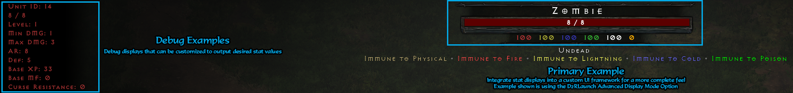

# d2rhud

Similar to [D2RHUD](https://github.com/locbones/D2RHud) but adapted for use with the 2.4 version of client and TCP/IP support.
- Stat Display code can be edited in plugin/sample/sample.cpp
- Font Loading can be edited in D3D12Hook.cpp
- Used in conjunction with D2RLAN for customizations

Special Thanks to:
- scizzydo for resize logic
- Killshot for chat and detour structures
- [dschu012](https://github.com/dschu012) for D2R base configuration.

